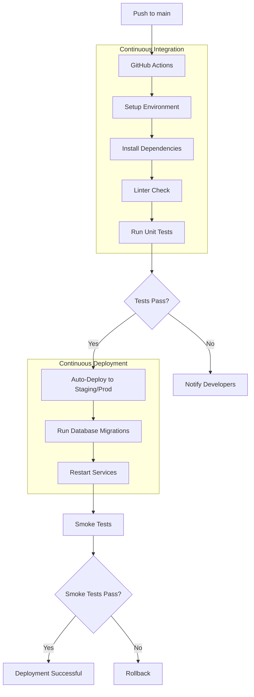

# CI/CD Pipeline Diagram

This diagram illustrates the automated workflow for the QueueLess Backend, from code push to deployment and verification.

### Pipeline Steps:
1. **Source Control**: Developers push code to the `main` branch.
2. **Build & Test**: GitHub Actions installs dependencies and runs the test suite (Pytest).
3. **Deployment**: If tests pass, the application is deployed to the target environment.
4. **Verification**: A smoke test script verifies that the application is alive and responding.
